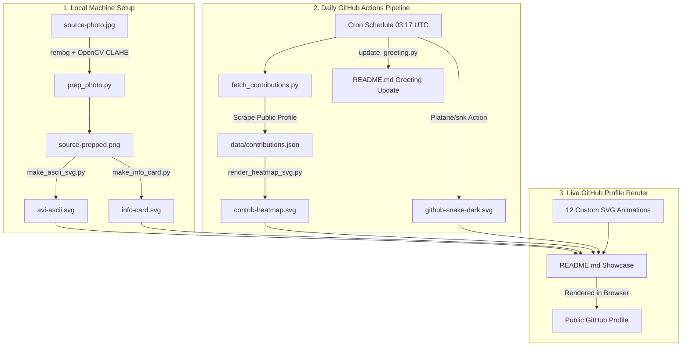
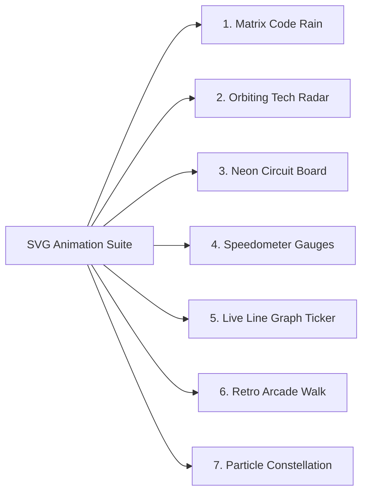

# 📘 Complete Engineering & Architectural Documentation
### **Animated GitHub Profile README & Data Analyst Engineering Suite**
**Author & Maintainer:** Bandia Arunkumar ([@bandiarunkumar](https://github.com/bandiarunkumar))  
**Email:** bandiarunkumar.ab@gmail.com  
**LinkedIn:** [arunkumar-bandi-a79728354](https://www.linkedin.com/in/arunkumar-bandi-a79728354)  
**Date:** August 2026  

---

## 📖 Executive Summary

This documentation provides an end-to-end technical, architectural, and visual explanation of the **Animated GitHub Profile README Toolkit**. The project transforms a standard static GitHub profile into a dynamic, dark-themed, terminal-style Data Analyst showcase powered by zero-dependency SVG vector animations, automated daily python scraping pipelines, and GitHub Actions cron jobs.

---

## 📊 High-Level System Architecture

The system operates across three decoupled layers: **Local Asset Generation**, **Automated Remote Pipelines**, and **Client-Side SVG Animation Rendering**.



---

## 🛠️ Step-by-Step Implementation Chronology

### **Phase 1: Environment & Toolchain Initialization**
* **What was done:** Initialized Python Virtual Environment (`.venv`), created directory hierarchy (`scripts/`, `data/`, `.github/workflows/`), and installed core dependencies (`pillow`, `opencv-python`, `rembg[cpu]`, `requests`, `beautifulsoup4`).
* **Reason:** Heavy image-processing libraries (`rembg`, `opencv`) were separated into local setup (`requirements-local.txt`), while only lightweight scraper tools (`requests`, `bs4`) were kept for the daily GitHub Actions workflow (`scripts/requirements.txt`).
* **Advantage:** Keeps GitHub Actions runner execution under 30 seconds, saving build minutes and avoiding CI timeouts.

---

### **Phase 2: Photo Preprocessing & Self-Typing ASCII Portrait**
* **What was done:** Built `scripts/prep_photo.py` and `scripts/make_ascii_svg.py`.
* **Technical Definition:**
  * **rembg (`u2net`):** Removes background noise from a profile photo to isolate the subject.
  * **CLAHE (Contrast Limited Adaptive Histogram Equalization):** Amplifies local facial contrast so highlights and shadows translate into sharp ASCII characters (` .`:-=+*cs#%@`).
* **SMIL Animation Technique:** Uses a `<clipPath>` rectangular mask with an animated `<animate attributeName="width">` to create a realistic terminal self-typing cursor effect.

```
+-------------------------------------------------------------+
| bandiarunkumar@github: ~$ cat portrait.txt                  |
|                                                             |
|   .:::::..                                                  |
|  .+#%@@@@%#+:    <--- Self-typing animation via SMIL ClipPath|
|  .=#@@@@@@%#:         Cursor travels X-axis from 0 to 860px |
|                                                             |
+-------------------------------------------------------------+
```

---

### **Phase 3: Neofetch Terminal Info Card**
* **What was done:** Created `scripts/make_info_card.py` generating `info-card.svg`.
* **Reason:** Displays professional Data Analyst background, tech stack (Python, SQL, PostgreSQL, Airflow, Tableau), and key highlights in an Ubuntu/Mac terminal window mockup (`whoami`).
* **Advantage:** Gives recruiters an immediate 5-second overview of experience without scrolling.

---

### **Phase 4: Tokenless Contribution Heatmap Scraper**
* **What was done:** Built `scripts/fetch_contributions.py` and `scripts/render_heatmap_svg.py`.
* **Reason:** Third-party profile stats services often fail or get rate-limited. This scraper fetches GitHub's public contribution calendar fragment directly (`https://github.com/users/bandiarunkumar/contributions`).
* **Advantage:** Requires **NO GitHub Personal Access Token (PAT)**, never expires, and calculates current streak, longest streak, and daily contribution counts locally into `data/contributions.json`.

---

### **Phase 5: Daily GitHub Actions Automation Workflow**
* **What was done:** Configured `.github/workflows/update-profile-art.yml`.
* **Automated Tasks:**
  1. Runs daily at `03:17 UTC`.
  2. Scrapes latest contributions and re-renders `contrib-heatmap.svg`.
  3. Executes `Platane/snk` action to generate the eating snake animation (`github-snake-dark.svg`).
  4. Runs `scripts/update_greeting.py` to update time-based greetings (`Good Morning ☀️` / `Good Evening 🌆`) based on IST timezone (UTC+5:30).
  5. Commits and pushes updated assets automatically.

---

### **Phase 6: The 7 Custom SVG Animation Suite**



1. **Matrix Code Rain (`matrix-rain.svg`):** Streams falling green binary and terminal code (`0101`, `SQL`, `PYTHON`) with staggered opacity decays.
2. **Orbiting Tech Radar (`tech-radar.svg`):** Concentric solar system orbits spinning tech nodes (`Py`, `SQL`, `PostgreSQL`, `Tableau`, `Docker`) around a central **DATA ANALYST** core.
3. **Neon Circuit Board (`circuit-board.svg`):** Electric pulses flowing across node traces connecting `INGESTION` ➔ `TRANSFORM` ➔ `ANALYTICS`.
4. **Speedometer Gauges (`gauge-meters.svg`):** 4 circular dashboard gauges with sweeping animated needles showing skill percentages (95% Data Prep, 88% SQL, 82% Tableau, 75% ML).
5. **Live Drawing Line Graph (`live-line-graph.svg`):** Ticker graph with an animated stroke-dashoffset trendline drawing real-time growth (+120% All-Time High).
6. **Retro Arcade Walk (`pixel-walk.svg`):** 16-bit animated dev sprite walking across a pixel floor collecting star coins.
7. **Dynamic Particle Constellation (`particle-constellation.svg`):** Bouncing floating data mesh nodes simulating distributed data pipelines.

---

### **Phase 7: Data Analyst Architecture & Interactive Terminal**
* **`data-arch.svg`:** End-to-end system flow diagram: `1. SOURCES` ➔ `2. ETL & CLEAN` ➔ `3. WAREHOUSE` ➔ `4. INSIGHTS`.
* **`terminal-run.svg`:** Animated bash execution simulation showing real-time logs processing 1.25M rows.

---

### **Phase 8: Strict Copyright Protection & DMCA System**
* **What was done:** Created `LICENSE` (All Rights Reserved), embedded digital SVG watermarks, and added protection badges to README.
* **Reason & Advantage:** Protects your custom designs from being copied or stolen by other users.

```
+-------------------------------------------------------------------------+
| DIGITAL WATERMARK EMBEDDED IN ALL SVG VECTOR FILES                      |
| <!-- © 2026 Bandia Arunkumar. All Rights Reserved. GitHub: @bandiarunkumar --> |
+-------------------------------------------------------------------------+
```

---

## 📚 Component Catalog & Definitions Matrix

| Component File | Tech Stack | Purpose & Reason | Value & Advantage |
|----------------|------------|------------------|-------------------|
| **`README.md`** | GitHub Flavored HTML/Markdown | Primary user profile page | Structured presentation with zero broken elements |
| **`LICENSE`** | Legal Copyright Document | Protects code & artwork | Gives legal standing for DMCA takedown against copiers |
| **`profile-banner.svg`** | SVG / CSS SMIL | Top header hero banner | Immediate high-end visual impression |
| **`avi-ascii.svg`** | SVG / CLAHE / rembg | Custom portrait ASCII art | Unique personal branding |
| **`info-card.svg`** | SVG Vector | Neofetch experience card | Concise 5-second technical summary |
| **`contrib-heatmap.svg`** | Python / SVG | Contribution graph | Tokenless, immune to 3rd party server outages |
| **`matrix-rain.svg`** | SVG Animation | Matrix terminal visual | Eye-catching hacker / dev aesthetic |
| **`tech-radar.svg`** | SVG 3D Transforms | Tech stack visual | Shows key tools in continuous motion |
| **`data-arch.svg`** | SVG System Diagram | Data pipeline flow | Proves Data Analytics & Pipeline engineering depth |
| **`circuit-board.svg`** | SVG SMIL Dashoffset | High-speed processing card | Modern tech aesthetic |
| **`gauge-meters.svg`** | SVG Arc Calculation | Skill level speedometers | Clear visual metric display |
| **`live-line-graph.svg`**| SVG Path Animation | Analytics growth ticker | Dynamic financial/analytics dashboard feel |
| **`pixel-walk.svg`** | SVG Keyframe Translate | Retro dev game animation | Interactive & playful user engagement |
| **`particle-constellation.svg`** | SVG Bouncing Nodes | Distributed data mesh | Modern AI & Big Data visual symbol |
| **`wave-footer.svg`** | SVG Sine Waves | Bottom page transition | Smooth visual conclusion to profile |

---

## 🔒 Security & Intellectual Property Rights

1. **Copyright Owner:** Bandia Arunkumar (`bandiarunkumar.ab@gmail.com`)
2. **License Type:** All Rights Reserved
3. **DMCA Policy:** Any unauthorized republication, cloning, or distribution of these custom vector graphics or README design on GitHub will result in an immediate DMCA Takedown Notice filed with GitHub Legal.

---

*This document is stored locally at `/Users/bandiarunkumar0gmail.com/Documents/GitHub/bandiarunkumar/PROJECT_DOCUMENTATION.md` and synced with GitHub.*
