## 📊 GitHub Contribution Heatmap

<h3><code>bandiarunkumar@github ~ $ ./contributions.sh</code></h3>

  

## 👤 Profile & Experience

<h3><code>bandiarunkumar@github ~ $ whoami</code></h3>
<table>
  <tr>
    <td valign="top"></td>
    <td valign="top"></td>
  </tr>
</table>

  

## 🐍 Contribution Snake Game

<h3><code>bandiarunkumar@github ~ $ ./snake.sh</code></h3>
<picture>
  <source media="(prefers-color-scheme: dark)" srcset="./github-snake-dark.svg" />
  <source media="(prefers-color-scheme: light)" srcset="./github-snake.svg" />
  
</picture>

