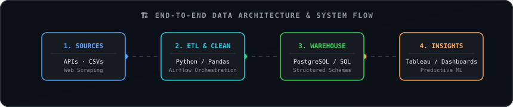
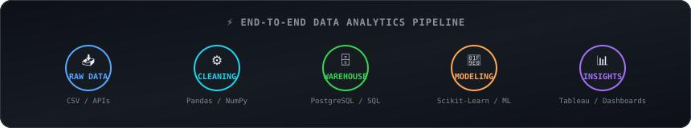
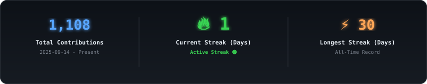

<!-- Profile Banner -->

 

<!-- Dynamic Greeting (auto-updated daily by GitHub Actions) -->
<!-- GREETING -->Good Morning ☀️, I'm <strong>Bandia Arunkumar</strong>! Welcome to my profile.<!-- /GREETING -->

 

<!-- Animated Typing Roles -->

  

<!-- Visitor Counter & Professional Contact Badges -->

 

  

---

## 👤 Executive Profile & Overview

<table width="860" cellpadding="8">
  <tr>
    <td valign="top" align="center" width="45%"></td>
    <td valign="top" width="55%"></td>
  </tr>
</table>

  

---

## 🚀 Featured Data Analytics & Engineering Projects

<table width="860" cellpadding="10">
  <tr>
    <td width="50%" valign="top">
      <h3>📊 HR Attrition Analytics Pipeline</h3>
      
End-to-end data pipeline analyzing employee turnover patterns. Processed structured workforce datasets using Python & PostgreSQL, orchestrated workflows via Apache Airflow, and delivered interactive executive insights in Tableau.

      
        
      
      
      
      
    </td>
    <td width="50%" valign="top">
      <h3>🛒 Customer Shopping Behavior Analysis</h3>
      
Comprehensive exploratory data analysis and customer segmentation. Executed complex SQL window functions and cohort analysis in PostgreSQL & Jupyter, creating business dashboards for consumer trend analysis.

      
        
      
      
      
      
    </td>
  </tr>
  <tr>
    <td width="50%" valign="top">
      <h3>🧠 Data Structures & Algorithmic Solutions</h3>
      
Curated repository of optimized LeetCode & algorithmic problem solutions in Python. Focuses on space-time complexity analysis (Big-O), data structure design, and technical interview preparation.

      
        
      
      
      
    </td>
    <td width="50%" valign="top">
      <h3>📅 365 Days Data Analytics Challenge</h3>
      
Continuous daily repository documenting end-to-end data projects. Covers SQL query tuning, data cleaning, statistical modeling, data visualization, and automated ETL scripting.

      
        
      
      
      
    </td>
  </tr>
</table>

  

---

## 🏗️ Data Architecture & Pipeline Engineering

  

  

  

<!-- Morphing Vector Engine Suite -->

  

  

  

---

## 🛠️ Technical Stack & Skill Proficiency

  

  

  

  

---

## 🎯 Technical Focus & Learning Roadmap

<table width="860" cellpadding="8">
  <tr>
    <td width="50%" valign="top">
      <h3>🎯 Core Professional Competencies</h3>
      <ul>
        <li><b>Automated Data Engineering Pipelines</b> &amp; Workflow Orchestration</li>
        <li><b>Advanced SQL Performance Tuning</b>, Indexing &amp; Schema Design</li>
        <li><b>Executive BI Dashboards</b> &amp; Predictive Analytics Modeling</li>
      </ul>
    </td>
    <td width="50%" valign="top">
      <h3>📚 Advanced Technical Roadmap</h3>
      <ul>
        <li><b>Apache Spark &amp; PySpark</b> for Distributed Big Data Processing</li>
        <li><b>DuckDB &amp; dbt</b> for Modern Analytical Transformations</li>
        <li><b>LLM &amp; AI Data Agents</b> for Automated Insights Generation</li>
      </ul>
    </td>
  </tr>
</table>

  

---

## 📊 Verified GitHub Analytics & Activity

  

  

  

  

---

## 🕹️ Developer Experience & Arcade

  

<picture>
  <source media="(prefers-color-scheme: dark)" srcset="./github-snake-dark.svg" />
  <source media="(prefers-color-scheme: light)" srcset="./github-snake.svg" />
  
</picture>

  

---

## ⚡ Development Environment & Workflow

  

---

## 🔒 Intellectual Property & Legal Notice

 

> ⚠️ **Notice:** This repository layout, custom SVG animations, graphic artwork, and codebase are protected under an **All Rights Reserved** License.
> Unauthorized copying, cloning, or distribution of these assets is strictly prohibited and subject to GitHub DMCA enforcement.

  

<!-- Animated Wave Footer -->

⚡ This profile auto-refreshes daily via GitHub Actions · Contribution graph · Snake animation · Greeting updated every run

